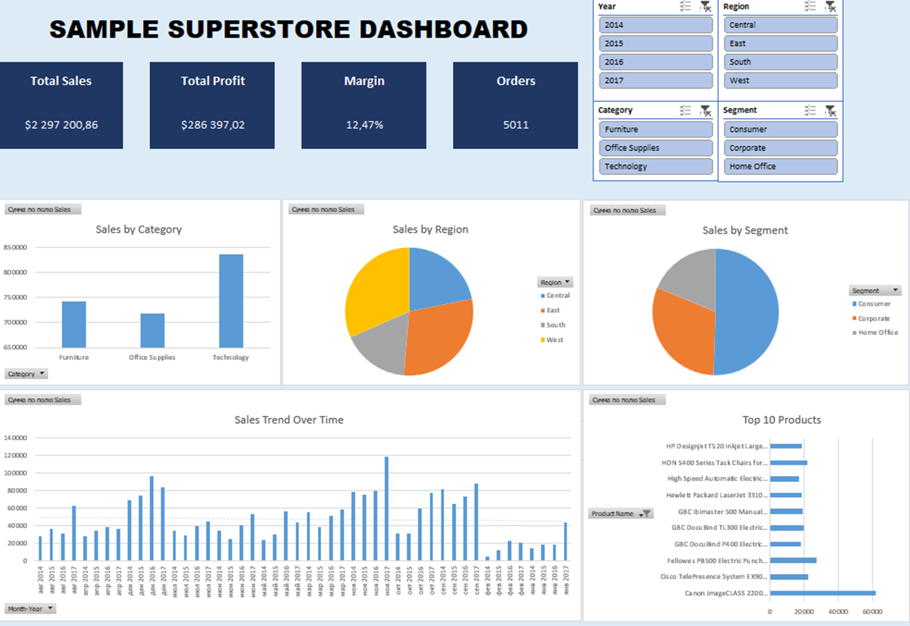

# Excel Sales Analysis — Superstore Dataset

## Project Description
This project presents a full-cycle sales data analysis performed in Microsoft Excel using the *Sample Superstore* dataset.

The objective is to demonstrate core data analysis skills, including:
- data cleaning
- data transformation
- KPI calculation
- dashboard development

---

## Project Structure

excel_sales_analysis/

│

├── dashboard/

│ └── dashboard.png

│

├── data/

│ └── Sample - Superstore.csv

│

├── excel/

│ └── sales_analysis.xlsx

│

└── README.md

---

## Dashboard

---

## Dashboard Overview
The dashboard provides a high-level view of sales performance and includes:

- Key performance indicators (KPI)
- Sales analysis by category, region, and segment
- Sales trends over time
- Top 10 products by revenue
- Interactive filters (slicers)

---

## Data Processing Workflow

### 1. Data Loading and Initial Analysis
- Imported CSV dataset into Excel
- Reviewed dataset structure (rows, columns)
- Checked for missing values
- Validated data types (dates, numeric fields)

### 2. Data Cleaning and Feature Engineering
A separate sheet (**Cleaned Data**) was created with additional calculated fields:

| Column         | Description               |
|----------------|--------------------------|
| Month          | Month name               |
| Year           | Year                     |
| Month-Year     | Period for trend analysis|
| Day of Week    | Day name                 |
| Revenue        | Copy of Sales            |
| Profit Margin  | Profit ratio             |
| Discount Level | Discount category        |
| Order Volume   | Order size category      |

---

### 3. Mapping Tables
Supporting tables were created to standardize and enrich data:

- Region standardization
- Category grouping
- Shipping priority classification

---

### 4. KPI Calculation
Key metrics calculated on the **KPI Calculator** sheet:

- Total Sales
- Total Profit
- Profit Margin
- Number of Orders
- Average Order Value
- Total Quantity Sold
- Average Discount

---

### 5. Pivot Tables
Created pivot tables:

- Sales by Category
- Sales by Region
- Sales Trend Over Time
- Top 10 Products
- Sales by Customer Segment
- Shipping Performance

---

### 6. Data Visualization
Built charts based on pivot tables:

- Column chart (categories)
- Pie chart (regions)
- Line chart (sales trend)
- Bar chart (top products)
- Column chart (segments)

---

### 7. Interactivity
The dashboard includes:

- **Slicers:**
  - Year
  - Region
  - Category
  - Segment

- Optional metric selector (form controls)

---

## Key Insights
- Technology is the leading category by sales and profit
- The West region shows the highest performance
- Sales demonstrate seasonal patterns
- A small number of products generate a large share of revenue (Pareto principle)

---

## Tools and Technologies
- Microsoft Excel
  - Pivot Tables
  - Charts
  - Functions (XLOOKUP, IF, TEXT, etc.)
  - Slicers and Timeline

---

## How to Use
1. Download the repository  
2. Open: `excel/sales_analysis.xlsx`  
3. Go to the **Dashboard** sheet  

## Author

Data Analyst Portfolio Project

Author: **Lada Pavlova**

GitHub: https://github.com/pavllada
